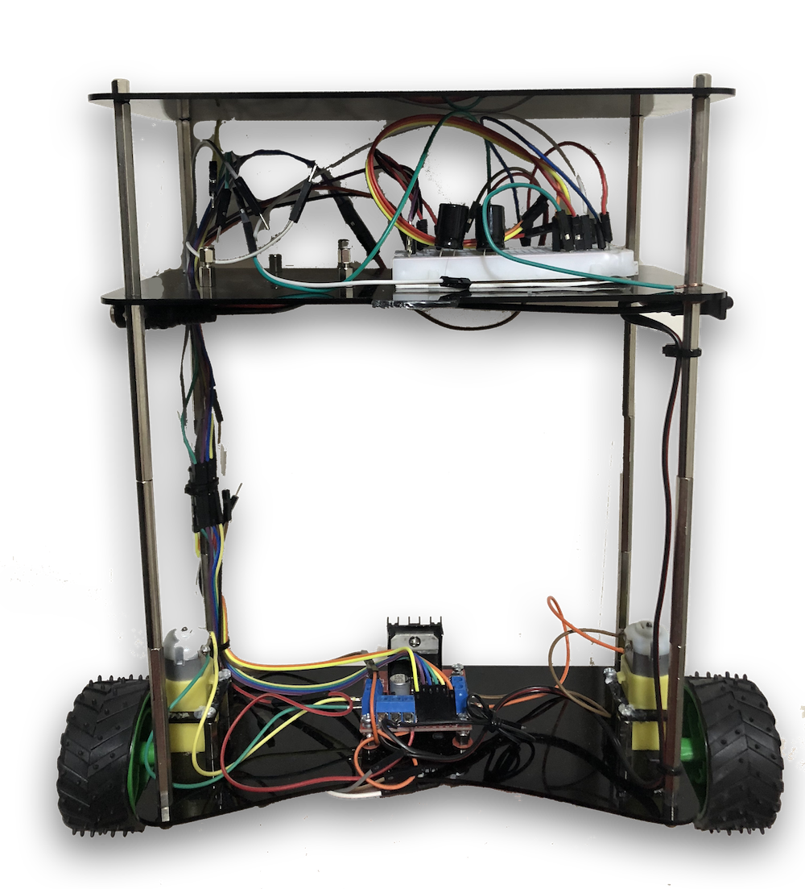

Self Balancing Robot
======
# 

Real-Time and Embedded Systems Course
Arduino Self balancing robot

Students
--------
Milad Hakimi
Sahar Rajabi
Sadegh Hayeri

Repo structure
--------------
* Libraries/*: Libraries should be copied to local Arduino libraries folder

Components
----------
* Arduino UNO
* MPU6050 (GY-25)
* L298N Motor Driver
* 2 Toy DC motors + GearBox + 80mm wheels
* Bluetooth HC-05 module

Video
------

